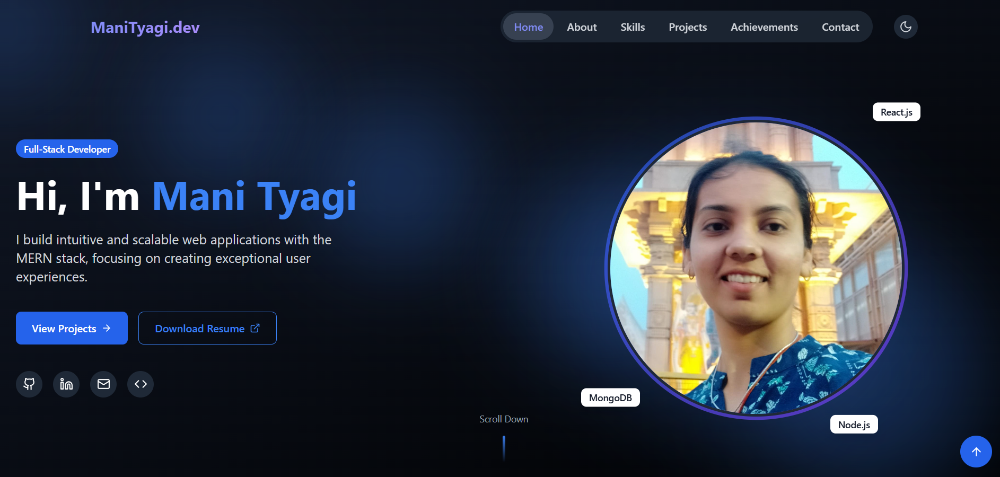

# Personal Portfolio Website

[](https://reactjs.org/)
[](https://vitejs.dev/)
[](https://tailwindcss.com/)
[](https://www.framer.com/motion/)
[](https://opensource.org/licenses/MIT)

Welcome to the source code repository for my personal portfolio website!

## 👋 Introduction

Hello! I'm **Mani Tyagi**, a final year B.Tech student at I.K Gujral Punjab Technical University, Mohali Campus 1. This portfolio serves as a showcase of my skills, projects, achievements, and journey in the world of technology and software development. It's built using modern web technologies like **Vite**, **React**, and **Tailwind CSS** for a fast, responsive, and visually appealing experience.

**Live Demo:** https://manityagi.vercel.app/

## 📸 Screenshot / Demo



## ✨ Features

*   **Modern Tech Stack:** Built with Vite for lightning-fast development and React for a component-based UI.
*   **Responsive Design:** Fully responsive layout adapting to various screen sizes (desktops, tablets, mobiles) using Tailwind CSS.
*   **Smooth Animations:** Engaging user experience with subtle animations powered by Framer Motion.
*   **Component-Based:** Organized structure with reusable React components (`Navbar`, `Footer`, `ProjectCard`, etc.).
*   **Sections:**
    *   Hero Section: A welcoming introduction.
    *   About Me: Detailed background and interests.
    *   Skills: Overview of technical skills.
    *   Projects: Showcase of personal and academic projects.
    *   Achievements: Highlighting accomplishments.
    *   Blogs (Optional): A section for blog posts (if implemented).
    *   Resume: Link or section to view/download my resume.
    *   Contact: An easy way to get in touch via a functional contact form (using EmailJS).
*   **Performance Optimized:** Vite ensures optimized builds for production.
*   **Clean Code:** Following best practices with ESLint for code quality.

## 🛠️ Tech Stack

*   **Frontend Framework:** [React.js](https://reactjs.org/) (v18.2.0)
*   **Build Tool:** [Vite](https://vitejs.dev/) (v5.1.4)
*   **Styling:** [Tailwind CSS](https://tailwindcss.com/) (v3.4.1) with PostCSS & Autoprefixer
*   **Animations:** [Framer Motion](https://www.framer.com/motion/) (v12.6.3)
*   **Icons:** [Lucide React](https://lucide.dev/) (v0.487.0)
*   **Contact Form:** [EmailJS](https://www.emailjs.com/) (@emailjs/browser v4.4.1)
*   **Linting:** [ESLint](https://eslint.org/)
*   **Package Manager:** npm (or yarn, if you use it)
*   **Version Control:** Git & GitHub

## 📂 Project Structure

```
├── public/                  # Static assets (images, favicons, etc.)
├── src/
│   ├── components/          # Reusable UI components (Navbar, Footer, ProjectCard, etc.)
│   │   ├── About.jsx
│   │   ├── Achievements.jsx
│   │   ├── Blogs.jsx
│   │   ├── Contact.jsx
│   │   ├── Footer.jsx
│   │   ├── Hero.jsx
│   │   ├── Navbar.jsx
│   │   ├── ProjectCard.jsx
│   │   ├── Projects.jsx
│   │   ├── Resume.jsx
│   │   └── Skills.jsx
│   ├── pages/               # Page-level components (currently components seem to act as pages)
│   ├── App.jsx              # Main application component (routing/layout)
│   ├── index.css            # Global CSS / Tailwind base styles
│   └── main.jsx             # Application entry point
├── .eslintrc.cjs            # ESLint configuration
├── .gitignore               # Git ignore file
├── index.html               # HTML entry point template
├── package-lock.json        # Dependency lock file
├── package.json             # Project metadata and dependencies
├── postcss.config.js        # PostCSS configuration
├── tailwind.config.js       # Tailwind CSS configuration
└── vite.config.js           # Vite configuration
```

## 🚀 Getting Started

To run this project locally, follow these steps:

1.  **Clone the repository:**
    ```bash
    git clone https://github.com/Mani-Tyagi-1/Portfolio-1.git
    ```
2.  **Navigate to the project directory:**
    ```bash
    cd Portfolio-1/Frontend
    ```
3.  **Install dependencies:**
    ```bash
    npm install
    ```
    *(or `yarn install` if you prefer yarn)*

4.  **Set up Environment Variables:**
    This project uses EmailJS for the contact form. You need to create a `.env` file in the root directory and add your EmailJS credentials.
    Create a file named `.env` and add the following variables (get these from your EmailJS account):
    ```env
    VITE_EMAILJS_SERVICE_ID=[Your_EmailJS_Service_ID]
    VITE_EMAILJS_TEMPLATE_ID=[Your_EmailJS_Template_ID]
    VITE_EMAILJS_PUBLIC_KEY=[Your_EmailJS_Public_Key]
    ```
    *Note: Vite requires environment variables exposed to the client-side to be prefixed with `VITE_`.*

5.  **Run the development server:**
    ```bash
    npm run dev
    ```
    *(or `yarn dev`)*

6.  Open your browser and navigate to `http://localhost:5173` (or the port specified by Vite).

## 📜 Available Scripts

In the project directory, you can run the following scripts:

*   `npm run dev`: Runs the app in development mode.
*   `npm run build`: Builds the app for production to the `dist` folder.
*   `npm run lint`: Lints the project files using ESLint.
*   `npm run preview`: Serves the production build locally for preview.

## ☁️ Deployment

This project can be easily deployed to platforms like:

*   [Netlify](https://www.netlify.com/)
*   [Vercel](https://vercel.com/)
*   [GitHub Pages](https://pages.github.com/)

**General Steps:**

1.  Run the build command: `npm run build`.
2.  Deploy the contents of the generated `dist/` folder to your chosen platform.
3.  Configure environment variables (like the `VITE_EMAILJS_*` ones) in your deployment platform's settings.


## 📫 Contact
**Mani Tyagi**

*   **LinkedIn:** https://www.linkedin.com/in/mani-tyagi-958415232z/
*   **GitHub:** https://github.com/Mani-Tyagi-1
*   **Email:** manityagi1919@gmail.com

---